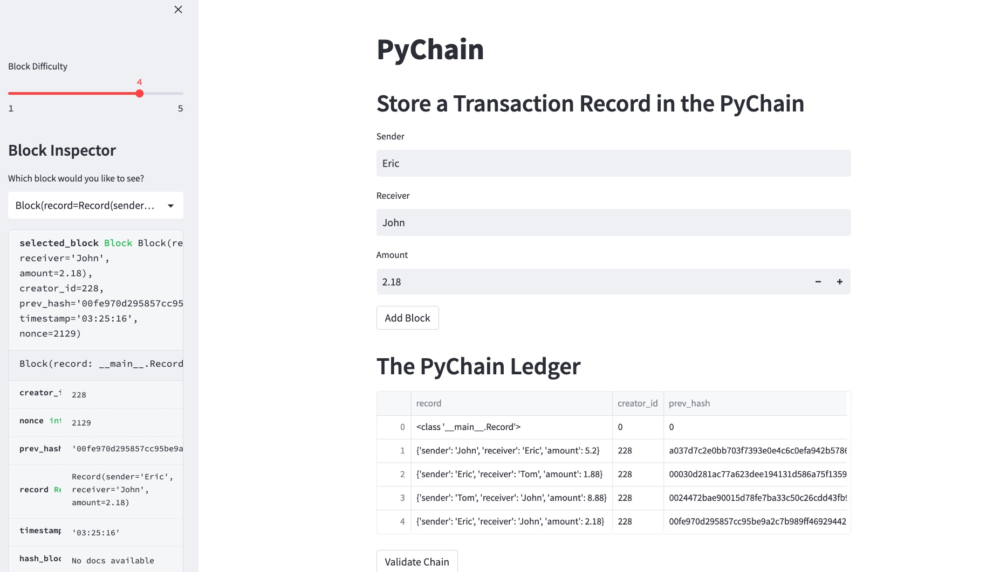
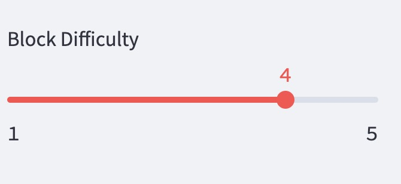
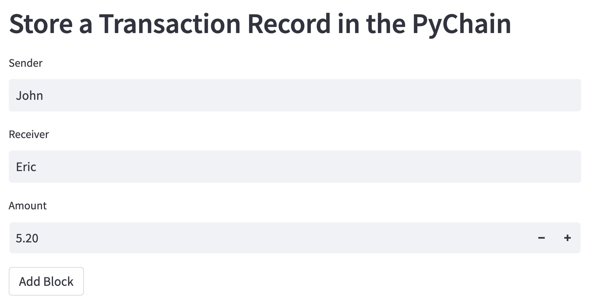
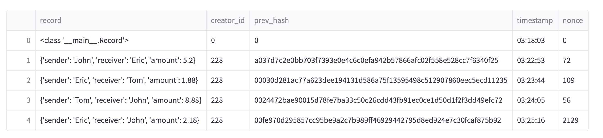
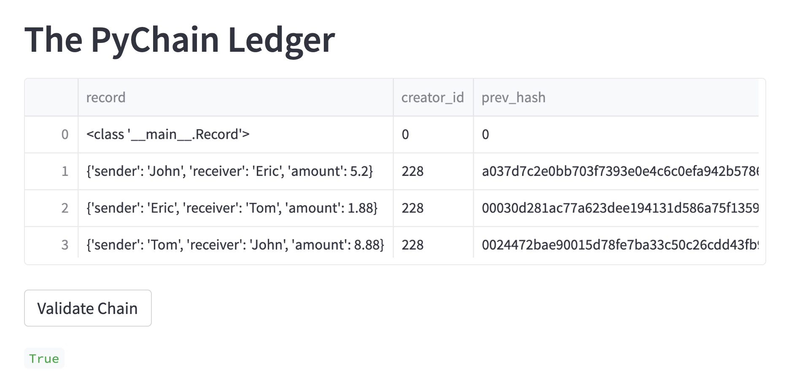
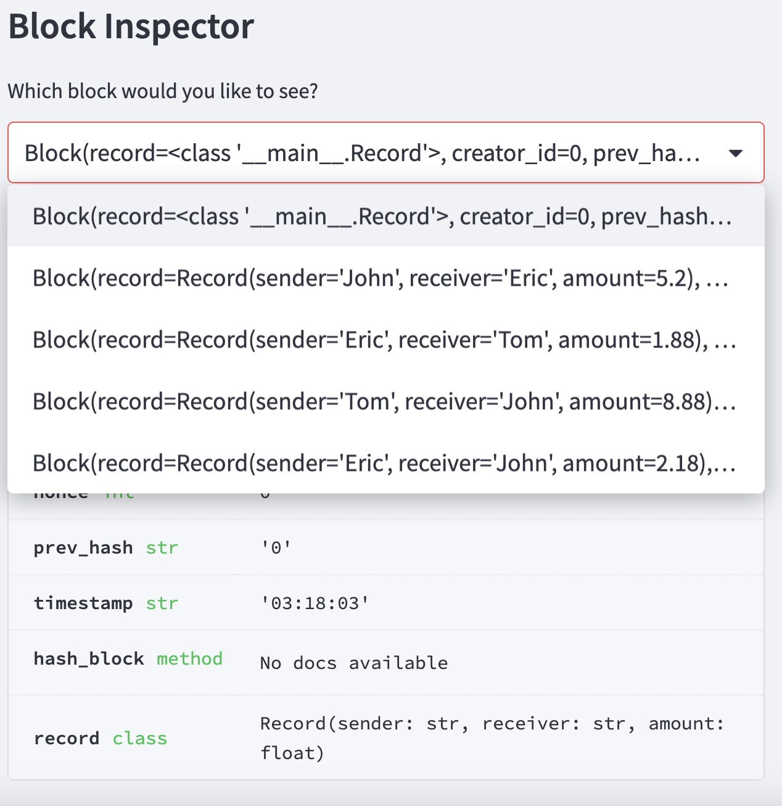
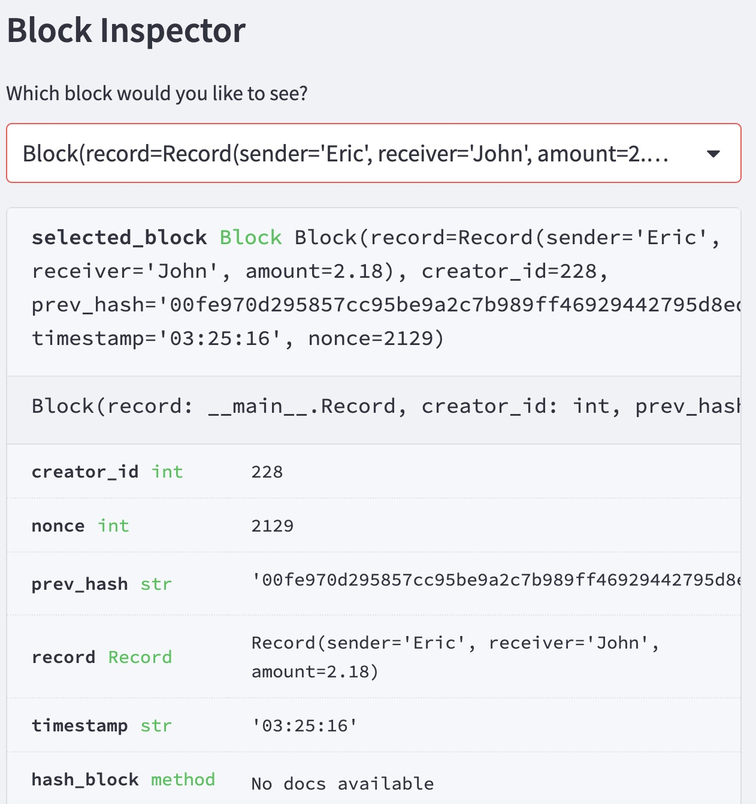

# Module 18 PyChain Ledger

In this assignment, build a blockchain-based ledger system, and the Steamlit application to delevpe a user-friendly web interface. This ledger allows partner banks to conduct financial transactions and verify the integrity of the data in ledger. This blockchain-based ledger system consists of four main functions: Choose block difficulty, Store a transaction record in the PyChain, Validate Chain, and Block Inspector.

---------------------------------------------------------------------------
## Choose Block Difficulty
In the first step, the difficulty value is set to adjust the level of difficulty in generating hash values. A higher difficulty value means more computational work is required, resulting in a higher level of security. In my blockchain-based ledger system, there are a total of 5 difficulty levels, ranging from 1 to 5, with an initial level set to 2. Before recording and converting each transaction into hash values for storage, the difficulty level needs to be selected.

---------------------------------------------------------------------------
## Store a transaction record in the PyChain

Store each transaction in the blockchain. Enter the sender, receiver, and amount of a transaction in the text input fields. Then, click the "Add Block" button to convert the transaction into a hash value and record it in a block. Each time a transaction is entered, a new block will be added to the blockchain, appended after the previous blocks. The new block will record the hash value of the previous block.

---------------------------------------------------------------------------
## Validating Chain

To verify if the transaction data has been tampered with, you can use the "Validate Chain" feature to check if the hash values on the blockchain have been modified. If the hash values on the blockchain are validated correctly, it will display True.

---------------------------------------------------------------------------
## Block Inspector

Select a specific transaction and display the detailed information of the transaction record, including the sender, receiver, amount, creditor ID, and the previous hash value. By examining the transaction details, potential errors or risks can be easily identified.

